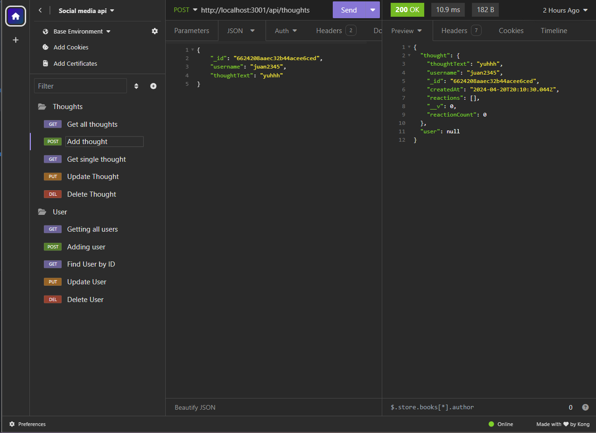
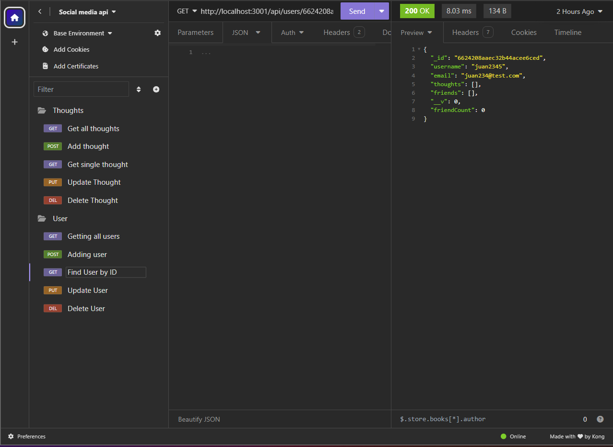

# BuzzBridge-

https://github.com/juanthtgotaway/BuzzBridge-/assets/121774171/b274063f-8d13-43fe-89ef-7ccc38a2dbf8

[Video Deployment](https://drive.google.com/file/d/10wVvkv27RnOJ7-2EXIS2yTmxK8He9OGt/view?usp=drive_link)

## Description
The reason for this project was to make a hypothetical backend for a social media platform. 
Along the way while working on this project the most important take away was making sure I was properly making sure my controllers worked and how my schemas are being set up!

## Table of Contents
-[Descriptions](#Descriptions)
-[Installation](#Installation)
-[Usage](#Usage)
-[Credits](#Credits)
-[Tests](#Tests)
-[License](#License)
-[Questions](##Questions)

## Installation
In order to install this project you will have to clone the repository: 
    1. Create a place where you will want to store all this information 
    2. Once there open GitBash
    3. Clone this repository into the file you will have this stored in
            enter following: git@github.com:juanthtgotaway/BuzzBridge-.git
    4. Press enter to create your local clone

## Usage
Backend for a social media platform!

## Credits

## Tests
N/A
## License
MIT

## Questions
If you have any questions or concerns feel free to reach out via the following:
GitHub:[juanthtgotaway](https://github.com/juanthtgotaway)
